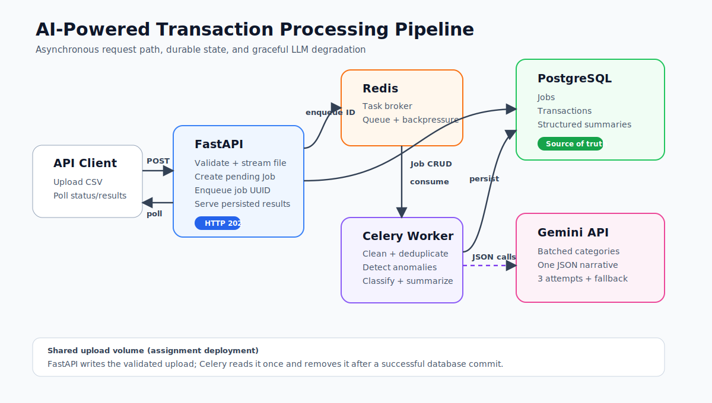

# AI-Powered Transaction Processing Pipeline

A production-shaped FastAPI service that accepts dirty transaction CSV files,
queues processing with Celery and Redis, persists results in PostgreSQL, and
uses Gemini for batched classification and a structured narrative summary.

The complete stack starts with one command:

```bash
docker compose up
```

No API key is required to exercise the system. When `GEMINI_API_KEY` is absent,
the worker completes the job with deterministic category/narrative fallbacks and
sets `llm_failed=true`. Supplying a key enables real Gemini calls without any
code change.

## Architecture



The editable draw.io source is at
[`docs/architecture.drawio`](docs/architecture.drawio). The request lifecycle is:

1. `POST /jobs/upload` streams and validates the CSV, persists a `pending` Job,
   enqueues its ID, and immediately returns HTTP 202.
2. Redis holds the durable task message until a Celery worker consumes it.
3. The worker marks the Job `processing`, cleans and deduplicates the CSV,
   detects anomalies, classifies missing categories in batches, and requests
   one structured narrative.
4. Transactions and the summary are committed to PostgreSQL in one transaction;
   the Job becomes `completed` (or `failed` with an error message).
5. Clients poll status and retrieve the structured result through the API.

## Quick start

Prerequisite: Docker with the Compose plugin.

```bash
docker compose up
```

Wait until the `api` and `worker` services are ready, then open:

- Swagger UI: <http://localhost:8000/docs>
- Health check: <http://localhost:8000/health>

The included sample is at `sample-data/transactions.csv`.

### Optional Gemini configuration

The no-key fallback makes the project zero-setup. To demonstrate real LLM
classification, create a local `.env` from `.env.example`, set
`GEMINI_API_KEY`, and start Compose. `.env` is intentionally gitignored.

## API examples

Upload a CSV:

```bash
curl -X POST http://localhost:8000/jobs/upload \
  -H "accept: application/json" \
  -F "file=@sample-data/transactions.csv"
```

Response:

```json
{
  "job_id": "989fa408-e459-43c7-b6b6-04a3ce04ce84",
  "status": "pending"
}
```

Poll status:

```bash
curl http://localhost:8000/jobs/989fa408-e459-43c7-b6b6-04a3ce04ce84/status
```

Retrieve results after completion:

```bash
curl http://localhost:8000/jobs/989fa408-e459-43c7-b6b6-04a3ce04ce84/results
```

List jobs or filter by status:

```bash
curl http://localhost:8000/jobs
curl "http://localhost:8000/jobs?status=completed"
```

`GET /results` returns HTTP 409 while a job is pending or processing. Upload
validation errors return HTTP 400, oversized files return HTTP 413, and missing
jobs return HTTP 404.

## Processing rules

### Cleaning

- Dates are normalized from `DD-MM-YYYY` or `YYYY/MM/DD` to ISO dates.
- `$` and comma separators are stripped before parsing amounts as decimals.
- Currency and status are normalized to uppercase.
- Missing source categories are stored as `Uncategorised`; `llm_category`
  stores the model/fallback classification, and `effective_category` exposes
  the final usable category.
- Exact raw-row duplicates are removed.

### Anomalies

- Amount greater than three times the transaction account's median.
- USD transaction at the domestic-only merchants Swiggy, Ola, or IRCTC.
- A transaction may contain both reasons.

### Aggregation decision

Anomaly detection considers every transaction, as requested. Spend totals,
category breakdown, and top merchants include only `SUCCESS` transactions:
failed and pending payments are not realized spend. Top merchants are ranked by
successful transaction frequency, with spend preserved per currency; INR and
USD are never added together without an exchange rate.

### LLM reliability

- Missing categories are sent in configurable batches (default 25), never one
  request per row.
- The narrative uses one additional structured JSON request.
- Transient failures are retried three times with exponential backoff.
- Exhausted classification batches are marked `llm_failed`; the overall job
  continues using transparent deterministic fallbacks.
- Numeric totals and anomaly counts are calculated by application code rather
  than trusted to probabilistic model output.

## Data model

- `jobs`: lifecycle, source filename, raw/clean counts, timestamps, failure.
- `transactions`: normalized values, anomaly evidence, LLM classification
  metadata, and a foreign key to the Job.
- `job_summaries`: currency totals, top merchants, category breakdown,
  narrative, risk level, and LLM failure metadata.

Indexes cover job status/time, transaction job/account lookups, and anomaly
queries. Foreign keys use cascading deletes.

## Local tests and quality checks

With Python 3.12:

```bash
python -m venv .venv
source .venv/bin/activate
pip install -r requirements-dev.txt
pytest --cov=app
ruff check .
```

On Windows PowerShell, activate with:

```powershell
.\.venv\Scripts\Activate.ps1
```

Tests include normalization, exact deduplication, both anomaly rules, spend
semantics, validation failures, and an end-to-end API/worker flow using SQLite.
CI runs tests and linting on every push.

## Scale and production follow-up

The current design is intentionally appropriate for the assignment-sized CSV.
At 100x traffic, the first limits would be API/worker connection pools, local
upload-volume I/O, worker memory from loading each CSV, LLM quotas, and large
JSON result responses.

The next iteration would:

- stream uploads directly to object storage and process CSV chunks;
- introduce Alembic migrations and PgBouncer;
- autoscale separate queues for CPU work and rate-limited LLM calls;
- add idempotency keys, task dead-lettering, and queue/LLM metrics;
- paginate transaction results and cache summary reads;
- partition large transaction tables and apply retention policies.

These changes improve isolation and horizontal scale at the cost of more
infrastructure, operational complexity, and eventual-consistency paths.
See the concise review walkthrough in
[`docs/video-script.md`](docs/video-script.md).

## Repository layout

```text
app/
  api/jobs.py           HTTP endpoints
  services/pipeline.py  CSV cleaning, anomaly rules, deterministic metrics
  services/llm.py       Gemini batching, structured JSON, retry, fallbacks
  models.py             SQLAlchemy schema
  tasks.py              Celery worker orchestration
docker-compose.yml      API, worker, Redis, and PostgreSQL
tests/                  unit and end-to-end tests
docs/                   architecture visual/source and video script
sample-data/            supplied assignment CSV
```
